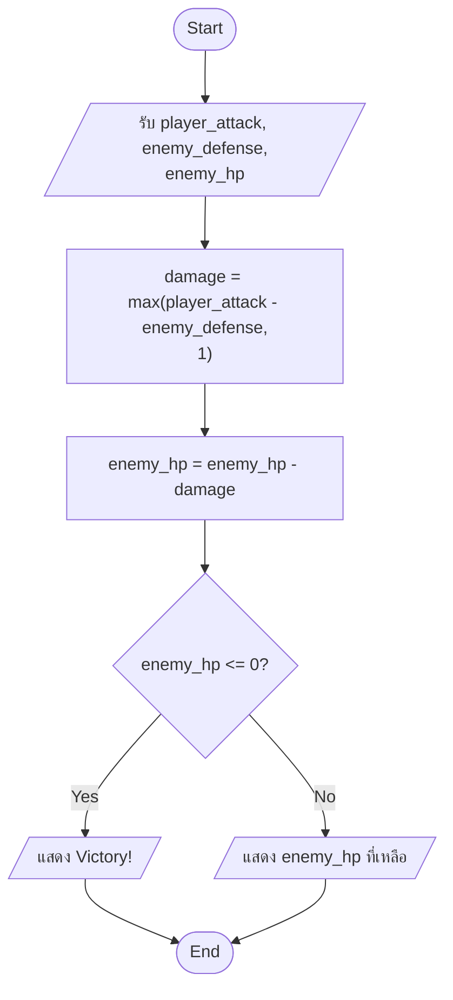
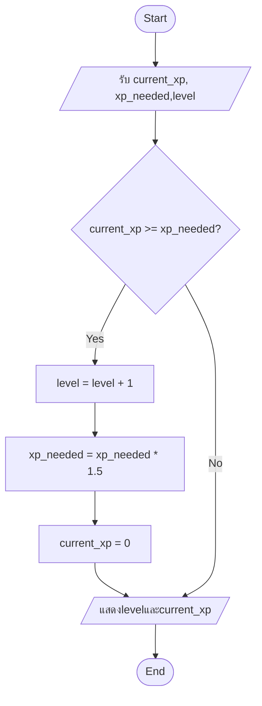
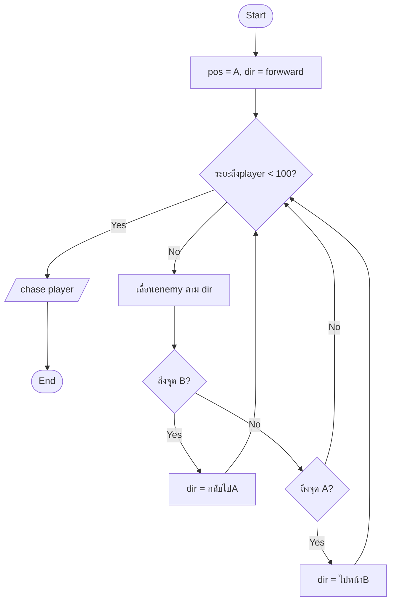

```mermaid
flowchart TD
 Start([Start]) --> Input[/รับ player_attack, enemy_defense,
enemy_hp/]
 Input --> Calc["damage = max(player_attack - enemy_defense,
1)"]
 Calc --> Reduce["enemy_hp = enemy_hp - damage"]
 Reduce --> D1{enemy_hp <= 0?}
 D1 -->|Yes| Win[/แสดง Victory!/]
 D1 -->|No| Show[/แสดง enemy_hp ที่เหลือ/]
 Win & Show --> End([End])
```

```mermaid
flowchart TD
 Start([Start]) --> Input[/รับ current_xp, xp_needed,level/]
 Input --> A{current_xp >= xp_needed?}
A -->|Yes| B[level = level + 1]
B --> C[xp_needed = xp_needed * 1.5]
C --> D[current_xp = 0]
D --> Output
A -->|No| Output[/แสดงlevelและcurrent_xp/]
Output --> End([End])
```

```mermaid
flowchart TD
 Start([Start]) --> Input[pos = A, dir = forwward]
Input --> A{ระยะถึงplayer < 100?}
A --> |Yes| A1[/chase player/]
A1 --> End([End])
A --> |No| A2[เลื่อนenemy ตาม dir]
A2 --> A3{ถึงจุด B?}
A3 -->|Yes| A4[dir = กลับไปA]
A4 --> A
A3 -->|No| A5{ถึงจุด A?}
A5 -->|Yes| A6[dir = ไปหน้าB]
A6 --> A
A5 -->|No| A
```

